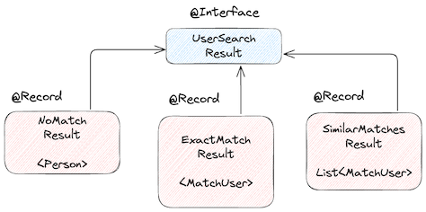
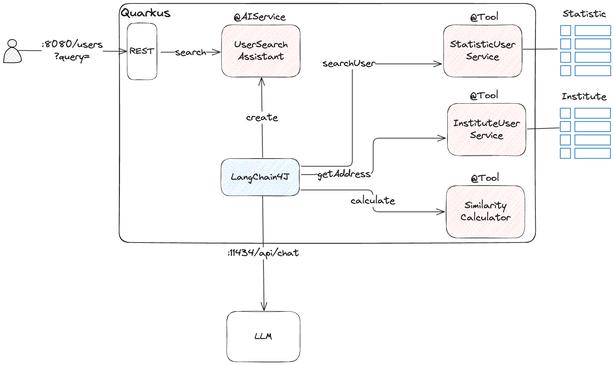
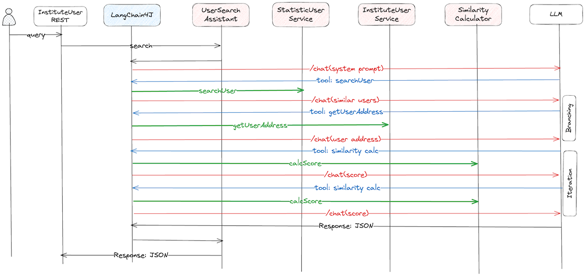

# Tools and Function Calling in the Context of LLMs

## Intro
Tools and function calling let LLMs move beyond pure text generation by interacting with external systems. With this approach, models can perform actions, fetch real-time information, and orchestrate multi-step tasks. The key benefits include extended capabilities, real-world execution, structured data generation for downstream processes, and the ability to build more dynamic, intelligent, and interactive agents.

A tool can be **anything**: a web search, an API call, or the execution of a specific piece of code.

It’s important to note that LLMs cannot execute tools directly. Instead, they **express the intent** to call a tool in their response (rather than replying with plain text). The actual execution happens in the application, which runs the tool with the provided arguments and then passes the result back to the model.

[LangChain4j](https://github.com/langchain4j/langchain4j) is a Java library that simplifies working with AI models through unified APIs. It supports multiple backends and provides utilities for building more advanced use cases on top of the basics.

For me, this project was an **experiment**: I wanted to see what happens if, instead of hardcoding business logic in Java, I let the **LLM orchestrate the logic** by calling tools. Could it really make decisions, iterate, and update structured data like a real program would?

That led me to explore, using **LangChain4j, [Quarkus](https://quarkus.io/), and [Ollama](https://ollama.com/)**, how LLMs handle:
* consuming, processing, and generating complex data structures,
* working around the lack of polymorphism in LangChain4j,
* manipulating the flow of execution, so the program becomes more dynamic and adaptable.

Think of it like classic control structures in programming — but driven by natural language instead of code:
* Selection → decisions and branching (like an `if` statement),
* Repetition → looping, i.e., repeating a step multiple times (like a `for` loop).

## The Problem I Wanted to Solve
Systems integration is not a new topic — we often need to access or provide data to other systems.

Let’s say our system — called **Institute** — stores data about users (names, addresses) provided during registration. The Institute needs to extend this information with a digital or external ID that belongs to another system — called **Statistic**.

The Statistic system also stores user data (names, addresses), but because it is a different system, the following scenarios can occur:
* the given user is not found in Statistic,
* there is an exact match for the given user in both systems,
* multiple hits are found based on the filtering criteria.

I used **first name, last name, and birth date** of the user as filtering criteria.
* In case of an exact match, Statistic sent back the external ID with the address data as well.
* But in case of multiple hits, Statistic sent back all records without the external ID!

So how can Institute decide which user record best matches?

Here I used the [Jaro–Winkler Distance](https://en.wikipedia.org/wiki/Jaro%E2%80%93Winkler_distance), a similarity measure that quantifies the difference between two strings, often used in record linkage, data deduplication, and string matching. I calculated similarity scores between addresses, and the response contained these scores for each record.

But the story did not stop there! I also wanted the LLM to generate a **detailed explanation** in the response about the exact differences between the records.

(By the way: I suspected I was asking too much from the LLM. But honestly, that was the main goal of this experiment 🙂).

### Example Outputs
Case 1: No user found in Statistic
```json
{
  "type": "NONEMATCH",
  "person": {
    "birthDate": "1990-05-21",
    "firstName": "Alice",
    "lastName": "Johnson"
  }
}
```

Case 2: Exact match found
```json
{
    "type": "EXACTMATCH",
    "user": {
        "externalId": "EXT-1001",
        "address": {
            "city": "Hamburg",
            "country": "Germany",
            "houseNumber": "10",
            "street": "Sample Str.",
            "zipCode": "20095"
        },
        "person": {
            "birthDate": "2000-07-21",
            "firstName": "Clara",
            "lastName": "Meier"
        }
    }
}
```

Case 3: Multiple candidate matches where 4 users were found
```json
{
    "type": "SIMILARMATCH",
    "users": [
        {
            "address": {
                "city": "Munich",
                "country": "Germany",
                "houseNumber": "56",
                "street": "Sendlinger Strasse",
                "zipCode": "80332"
            },
            "person": {
                "birthDate": "1982-04-08",
                "firstName": "Peter",
                "lastName": "Weber"
            },
            "explanation": "country matches, city matches, zipCode differs, street matches, houseNumber differs",
            "score": 0.968421052631579
        },
        {
            "address": {
                "city": "Munich",
                "country": "Germany",
                "houseNumber": "12A",
                "street": "Sendlinger Straße",
                "zipCode": "80331"
            },
            "person": {
                "birthDate": "1982-04-08",
                "firstName": "Peter",
                "lastName": "Weber"
            },
            "explanation": "country matches, city matches, zipCode matches, street differs, houseNumber differs",
            "score": 0.974089068825911
        },
        {
            "address": {
                "city": "Augsburg",
                "country": "Germany",
                "houseNumber": "11",
                "street": "Sendlinger Strasse",
                "zipCode": "80331"
            },
            "person": {
                "birthDate": "1982-04-08",
                "firstName": "Peter",
                "lastName": "Weber"
            },
            "explanation": "country matches, city differs, zipCode matches, street matches, houseNumber differs",
            "score": 0.853641765704584
        },
        {
            "address": {
                "city": "Salzburg",
                "country": "Austria",
                "houseNumber": "12",
                "street": "Sendlinger Strasse",
                "zipCode": "80331"
            },
            "person": {
                "birthDate": "1982-04-08",
                "firstName": "Peter",
                "lastName": "Weber"
            },
            "explanation": "country differs, city matches, zipCode matches, street matches, houseNumber matches",
            "score": 0.6634711779448621
        }
    ]
}
```

### My Constraints
* Must run locally (privacy and cost reasons).
* Should work on my laptop (32 GB RAM — not huge for LLMs).
* Prefer open-source tools.

## Technology Choices
I opted for:
* LangChain4j: Open, composable framework with a standard interface for models, tools, and databases. Perfect for building an LLM workflow in Java.
* Ollama: Runs locally, easy to use, and provides solid tooling support.
* Quarkus: Seamless integration with LangChain4j. Registering an AI service only requires annotations. Exposing tools is straightforward (just annotate your Java code). And not a small thing — developing with Quarkus is genuinely fun.

**Note:** I used Ollama as the LLM backend, which runs models locally. I tried several models, but for this experiment, I settled on `llama3-8b`, which provided a good balance between performance and quality.

Now let’s walk through each of the topics I mentioned in the introduction.

## Data Structures and Polymorphism
Polymorphism brings flexibility, reusability, and maintainability. I defined the Statistic API like this:
```java
UserSearchResult searchUser(String firstName, String lastName, String birthDate);
```
where `UserSearchResult` can represent different result types:
```java
sealed interface UserSearchResult permits NoMatchResult, SimilarMatchesResult, ExactMatchResult {}
record NoMatchResult(Person person) implements UserSearchResult {}
record ExactMatchResult(MatchUser user) implements UserSearchResult {}
record SimilarMatchesResult(List<MatchUser> users) implements UserSearchResult {}
```

And `MatchUser` looked like this:
```java
record MatchUser(Person person, Address address, Double score, String explanation, String externalId) {}
```

The full type hierarchy is shown below:



This design leveraged **sealed types** and **records** in Java, giving me safe and concise code.

But here’s the bad news: **LangChain4j does not support polymorphism.**
The LLM can consume and generate structured JSON, but it does not know which subtype a given JSON represents without a schema.

**Good news**: In LangChain4j, JSON schema is automatically generated from POJOs in Quarkus/Spring Boot. You can enhance them with `@Description`. Example:
```java
@Description("The user's personal information, for example, first name, last name, and birth date")
record Person(
    @Description("The user's first name") String firstName,
    @Description("The user's last name") String lastName,
    @Description("The user's birth date") String birthDate
) {}
```

But that still does not solve polymorphism. For that, I used [Jackson](https://github.com/FasterXML/jackson) java library annotations to help with serialization and deserialization.:
```java
@JsonTypeInfo(use = JsonTypeInfo.Id.CUSTOM, include = JsonTypeInfo.As.PROPERTY, property = "type")
sealed interface UserSearchResult permits NoMatchResult, SimilarMatchesResult, ExactMatchResult {}
```

With subtype markers:
```java
@UserSearchResultSubType("NONEMATCH")
record NoMatchResult(Person person) implements UserSearchResult {}
```

The "type" field is injected into JSON for the LLM, but is not part of the Java hierarchy (see the example outputs above).

## Flow of Execution
I did not want to implement the business logic in Java code. Instead, I only exposed the tools/functions that can be used by the LLM. But how can the application provide the expected output without a single line of business logic? This is where **system prompts** come into play! Instead of writing imperative code, I wrote a detailed description of the business logic in natural language, which guided the LLM in orchestrating the tools.

The following diagram shows the main components of the application and their relationships.



where the `UserSearchAssistant` is registered as an `AiService`, the other components are the tools, and LangChain4j handles the orchestration.

I defined the following tools:
* `StatisticUserService#searchUser(String firstName, String lastName, String birthDate)` Searches users in the Statistic database based on the provided filtering criteria. In this project, the service also runs within the same Java application, but in the real world it should be a remote service accessed via REST.
* `InstituteUserService#getUserAddress(Person person)` Retrieves the user’s address from the Institute system.
* `SimilarityDistanceCalculator#jaroWinklerSimilarity(Address original, Address similar)` Computes similarity scores between two addresses using the Jaro–Winkler distance algorithm.

** Note:** Some model can calculate similarity internally, but I wanted to experiment with tool calling.

Each tool has different parameter types that must be constructed properly by the model in order to be called. This is one of the reasons why **accurate JSON schema definitions** are so critical when working with LLMs.

Now let’s see how the sequence diagram looks in the case where similar users are found:



* The red arrows represent the REST calls to the LLM. These calls contain: which tool can be called/used, with which parameters, and in some cases, also the results of tool executions that should be taken into account by the model.
* The blue arrows are the responses sent back by the LLM. These contain the instructions for which tool should be executed, along with the provided parameters.
* The green arrows represent the actual tool executions performed by the application.

Here’s how the flow looks in detail:
* After we send the extended prompt (with tool descriptions) to the model, it **calls the Statistic API** to search for the user.
* The model analyzes the response and decides whether the case is a `SIMILARMATCH`.
* If it is, the model calls the **getUserAddress** tool to fetch the Institute user’s address, which will serve as the baseline for similarity calculations.
* Next, the model **ITERATES over the list of candidate addresses** and calls the **jaroWinklerSimilarity** tool for each candidate. (For simplicity, the diagram only shows two iterations.)
* After obtaining similarity scores, the model **updates the score fields** in the JSON.
* Finally, the model goes through each address field—country, city, zip code, street, house number—and **generates an explanation of the differences**, inserting them into the explanation field of the JSON.

Wow! It looks like a fairly complex workflow, but if you were to implement it in code, it would be quite straightforward. For the LLM, however, this orchestration is much more fragile and error-prone.

But how the LLM tool access request looks like? Here’s an example response body from the LLM when it wants to call the `jaroWinklerSimilarity` function:
```json
{
  "model": "llama3.1",
  "created_at": "2025-09-12T15:17:17.613184Z",
  "message": {
    "role": "assistant",
    "content": "",
    "tool_calls": [
      {
        "function": {
          "name": "jaroWinklerSimilarity",
          "arguments": {
            "original": {
              "city": "Munich",
              "country": "Germany",
              "houseNumber": "48",
              "street": "Sendlinger Strasse",
              "zipCode": "80331"
            },
            "similar": {
              "city": "Salzburg",
              "country": "Austria",
              "houseNumber": "12",
              "street": "Sendlinger Strasse",
              "zipCode": "80331"
            }
          }
        }
      }
    ]
  },
  "done_reason": "stop",
  "done": true,
  "total_duration": 2281647584,
  "load_duration": 53564417,
  "prompt_eval_count": 2519,
  "prompt_eval_duration": 115408667,
  "eval_count": 78,
  "eval_duration": 2101600166
}
```

The response is parsed by LangChain4j, which extracts the tool call request and executes the function with the provided arguments.
